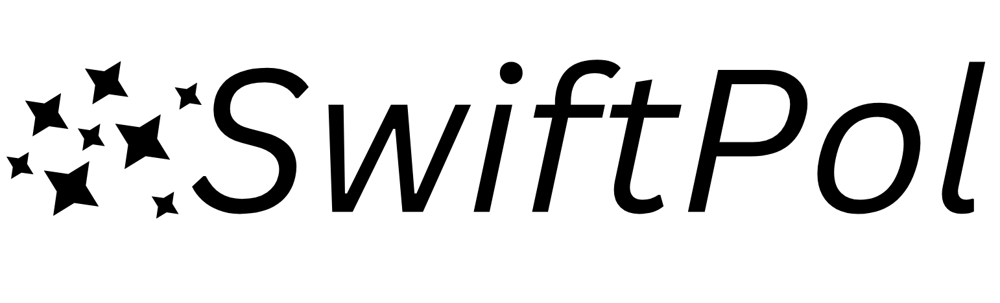

[](https://doi.org/10.5281/zenodo.15111991)
[](https://github.com/matta-research-group/SwiftPol/actions/workflows/SwiftPol_tests.yml)
[](https://matta-research-group.github.io/SwiftPol)
[](https://github.com/yourusername/yourrepository/blob/main/LICENSE)
[](https://github.com/matta-research-group/SwiftPol/commits/main)
[](https://github.com/matta-research-group/SwiftPol/stargazers)


# SwiftPol
Tools for building polydisperse polymer systems for molecular dynamics.

This repository is currently under development. To do a development install, clone this repository and type

`cd SwiftPol`

`pip install -e .`

### Contributing to SwiftPol

Features should be developed on branches. To create and switch to a branch, use the command

`git checkout -b < new_branch_name >`

To switch to an existing branch, use

`git checkout < new_branch_name >`

To submit your feature to be incorporated to the main branch, you should submit a Pull Request. The repository maintainers will review your pull request before accepting your changes.

### Example Notebooks
Examples of using SwiftPol code to build different polymers can be found at [Example Notebooks](Example_Notebooks/)
-  [Building a PLGA system](Example_Notebooks/PLGA_demo.ipynb)
-  [Building Chitin](Example_Notebooks/Chitin.ipynb)
-  [Constructing Reaction SMARTS](Example_Notebooks/rxn_smarts.ipynb)

### OpenEye License Guidance
[Instructions for implementing an OpenEye License (not essential but speeds up conformation determination)](https://docs.eyesopen.com/toolkits/python/quickstart-python/license.html)

Citation for OpenEye OMEGA:

Hawkins, P. C. D.; Skillman, A. G.; Warren, G. L.; Ellingson, B. A.; Stahl, M. T. Conformer Generation with OMEGA: Algorithm and Validation Using High Quality Structures from the Protein Databank and Cambridge Structural Database. J. Chem. Inf. Model. 2010, 50 (4), 572–584. https://doi.org/10.1021/ci100031x.

We acknowledge the use of a free academic license provided by OpenEye, Candence Molecular Sciences, Santa Fe, NM https://www.eyesopen.com/


### File Tree
```
.
├── CODE_OF_CONDUCT.md
├── Dev_tools
│   └── swiftpol.yml
├── docs
│   ├── api.rst
│   ├── _build
│   │   ├── doctrees
│   │   │   ├── api.doctree
│   │   │   ├── environment.pickle
│   │   │   ├── getting_started.doctree
│   │   │   └── index.doctree
│   │   └── html
│   │       ├── api.html
│   │       ├── genindex.html
│   │       ├── getting_started.html
│   │       ├── index.html
│   │       ├── _modules
│   │       │   ├── index.html
│   │       │   └── swiftpol
│   │       │       ├── build.html
│   │       │       └── parameterize.html
│   │       ├── objects.inv
│   │       ├── py-modindex.html
│   │       ├── search.html
│   │       ├── searchindex.js
│   │       ├── _sources
│   │       │   ├── api.rst.txt
│   │       │   ├── getting_started.rst.txt
│   │       │   └── index.rst.txt
│   │       └── _static
│   │           ├── basic.css
│   │           ├── css
│   │           │   ├── badge_only.css
│   │           │   ├── fonts
│   │           │   │   ├── fontawesome-webfont.eot
│   │           │   │   ├── fontawesome-webfont.svg
│   │           │   │   ├── fontawesome-webfont.ttf
│   │           │   │   ├── fontawesome-webfont.woff
│   │           │   │   ├── fontawesome-webfont.woff2
│   │           │   │   ├── lato-bold-italic.woff
│   │           │   │   ├── lato-bold-italic.woff2
│   │           │   │   ├── lato-bold.woff
│   │           │   │   ├── lato-bold.woff2
│   │           │   │   ├── lato-normal-italic.woff
│   │           │   │   ├── lato-normal-italic.woff2
│   │           │   │   ├── lato-normal.woff
│   │           │   │   ├── lato-normal.woff2
│   │           │   │   ├── Roboto-Slab-Bold.woff
│   │           │   │   ├── Roboto-Slab-Bold.woff2
│   │           │   │   ├── Roboto-Slab-Regular.woff
│   │           │   │   └── Roboto-Slab-Regular.woff2
│   │           │   └── theme.css
│   │           ├── doctools.js
│   │           ├── documentation_options.js
│   │           ├── file.png
│   │           ├── fonts
│   │           │   ├── Lato
│   │           │   │   ├── lato-bold.eot
│   │           │   │   ├── lato-bolditalic.eot
│   │           │   │   ├── lato-bolditalic.ttf
│   │           │   │   ├── lato-bolditalic.woff
│   │           │   │   ├── lato-bolditalic.woff2
│   │           │   │   ├── lato-bold.ttf
│   │           │   │   ├── lato-bold.woff
│   │           │   │   ├── lato-bold.woff2
│   │           │   │   ├── lato-italic.eot
│   │           │   │   ├── lato-italic.ttf
│   │           │   │   ├── lato-italic.woff
│   │           │   │   ├── lato-italic.woff2
│   │           │   │   ├── lato-regular.eot
│   │           │   │   ├── lato-regular.ttf
│   │           │   │   ├── lato-regular.woff
│   │           │   │   └── lato-regular.woff2
│   │           │   └── RobotoSlab
│   │           │       ├── roboto-slab-v7-bold.eot
│   │           │       ├── roboto-slab-v7-bold.ttf
│   │           │       ├── roboto-slab-v7-bold.woff
│   │           │       ├── roboto-slab-v7-bold.woff2
│   │           │       ├── roboto-slab-v7-regular.eot
│   │           │       ├── roboto-slab-v7-regular.ttf
│   │           │       ├── roboto-slab-v7-regular.woff
│   │           │       └── roboto-slab-v7-regular.woff2
│   │           ├── jquery.js
│   │           ├── js
│   │           │   ├── badge_only.js
│   │           │   ├── theme.js
│   │           │   └── versions.js
│   │           ├── language_data.js
│   │           ├── minus.png
│   │           ├── plus.png
│   │           ├── pygments.css
│   │           ├── README.md
│   │           ├── searchtools.js
│   │           ├── sphinx_highlight.js
│   │           └── _sphinx_javascript_frameworks_compat.js
│   ├── conf.py
│   ├── getting_started.rst
│   ├── index.rst
│   ├── make.bat
│   ├── Makefile
│   ├── README.md
│   ├── requirements.yaml
│   ├── _static
│   │   └── README.md
│   └── _templates
│       └── README.md
├── Example_Notebooks
│   ├── Chitin.ipynb
│   ├── oe_license.txt
│   ├── PLGA_demo.ipynb
│   └── rxn_smarts.ipynb
├── LICENSE
├── pyproject.toml
├── README.md
├── Repo
│   └── logo.jpg
├── setup.py
├── swiftpol
│   ├── build.py
│   ├── demo.py
│   ├── __init__.py
│   ├── parameterize.py
│   ├── __pycache__
│   │   ├── build.cpython-310.pyc
│   │   ├── build.cpython-311.pyc
│   │   ├── build.cpython-312.pyc
│   │   ├── demo.cpython-310.pyc
│   │   ├── demo.cpython-311.pyc
│   │   ├── demo.cpython-312.pyc
│   │   ├── __init__.cpython-310.pyc
│   │   ├── __init__.cpython-311.pyc
│   │   ├── __init__.cpython-312.pyc
│   │   ├── parameterize.cpython-310.pyc
│   │   ├── parameterize.cpython-311.pyc
│   │   └── parameterize.cpython-312.pyc
│   └── _version.py
└── tests
    ├── build_tests.py
    ├── demo_tests.py
    └── parameterize_tests.py
```

### Code of Conduct
All repository contributors should follow our [code of conduct](CODE_OF_CONDUCT.md)

#### Acknowledgements
Project based on the 
[Computational Molecular Science Python Cookiecutter](https://github.com/molssi/cookiecutter-cms) version 1.1.

Copyright (c) 2024, Hannah Turney, Matta Research Group

